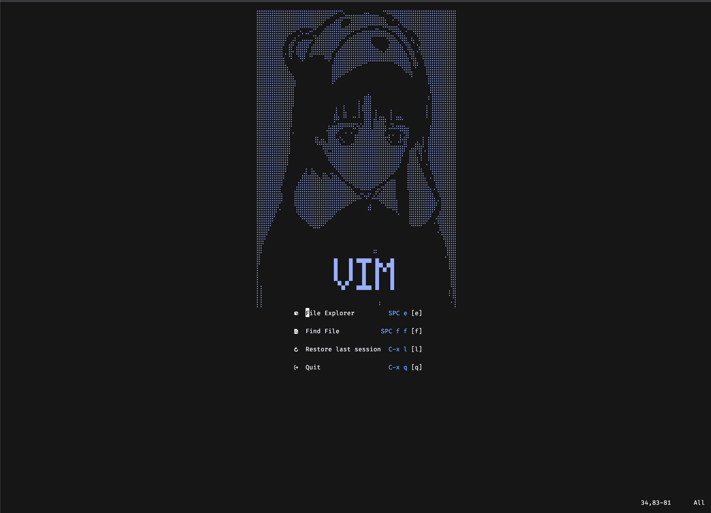
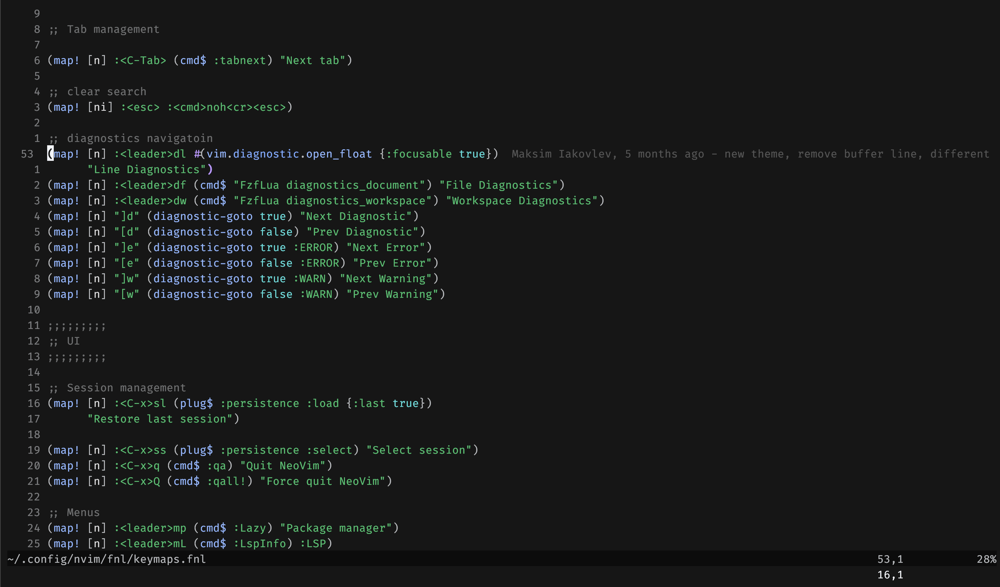

# VIM

My configuration of NeoVim IDE using Fennel language.

## System Dependencies

- neovim >= v0.11
- [fennel](https://fennel-lang.org/setup#downloading-fennel)
- fzf - file search
  - fd - better `find`
  - rg - better `grep`
  - bat - better `cat`
  - chafa - image previewer (optional)
- Nerd font
- Kitty or WezTerm

For personal wiki:
- zk - tool for maintaining personal wiki
- imagemagick - image previewer
- pngpaste - image paster
- pylatexnc - latex support

## Core plugins

- **Fennel building** - [tangerine](https://github.com/udayvir-singh/tangerine.nvim) + [hibiscus.nvim](https://github.com/udayvir-singh/hibiscus.nvim)
- **UI**:
    - **Navigation** - [Fzf-lua](https://github.com/ibhagwan/fzf-lua)
    - **Explorer** - [NeoTree](https://github.com/nvim-neo-tree/neo-tree.nvim)
    - **Dashboard** - [dashboard.nvim](https://github.com/nvimdev/dashboard-nvim)
- TODO: describe other plugins and their need

## Installation

1. Clone the project to `~/.config/nvim`
2. Install all system dependencies
3. Open nvim

### Screenshots

| Dashboard |
|-------|
|  |

| Workspace |
|-------|
|  |
